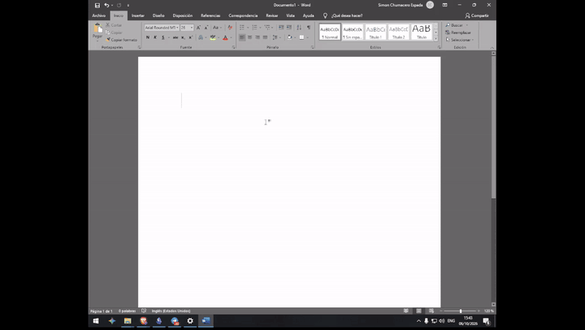

# VozLocal - offline dictation for low-end PCs

> **Speak. It types. No cloud, no limits, no GPU.**

VozLocal is 100% offline voice dictation in **Spanish and English**, built for **old
computers**. It runs on a 2014-era machine (NVIDIA GTX 750 Ti, Maxwell) using the **CPU
only**: no GPU, no internet, no subscription.

**Stack:** Python 3.10+ · faster-whisper (CPU int8) · tkinter · sounddevice · pynput

---

## Demo



Press **F9**, speak, press **F9** again. The transcript is pasted into whatever window has
focus, in this case a chat input box.

> Note on the overlay: the floating pill is a layered, always-on-top window, and most screen
> recorders on Windows do not capture layered windows. That is why this capture shows the
> result and not the pill itself. The states it displays are documented in
> [The overlay pill](#the-overlay-pill), and `assets/vozlocal-poster.png` shows the final frame.

---

## Why it exists

Modern dictation tools send your voice to the cloud and charge per word or per month.
VozLocal does the opposite:

- **Your voice never leaves your PC.** Nothing is uploaded, ever.
- **Free and unlimited.** No subscription, no word cap.
- **Runs on humble hardware.** Designed and measured on a 4-core i5-4460 with a GTX 750 Ti.
- **ES + EN, one reliable language per key.** Each hotkey *forces* the language instead of
  auto-detecting, which is slow and error-prone on modest hardware.
- **Live visual feedback.** A floating pill shows *listening*, with five bars driven by the
  real RMS of your microphone.

---

## Quick start

### Requirements

- Windows 10/11 (64-bit)
- Python 3.10+
- A microphone

### Install

```bash
pip install faster-whisper sounddevice pynput pyperclip numpy
```

### Run

```bash
# from the repo root
set PYTHONPATH=%CD%\src
python -m vozlocal
```

Or double-click `Dictar.bat`, a ready-made launcher. The Whisper model is downloaded **once**
on first start (that first run needs internet, after that it is cached).

---

## How to use

| Key | Action |
|---|---|
| **F8** | Dictate in **Spanish** (press to start, press again to write) |
| **F9** | Dictate in **English** (same behaviour) |

1. Click the text field where you want to write (Word, browser, Notepad, anything).
2. Press **F8** (or **F9**), speak in short sentences, press the SAME key again.
3. VozLocal transcribes and **pastes the text into your app**.

### The overlay pill

| State | What you see |
|---|---|
| Idle | `F8=ES · F9=EN` dark pill |
| Recording | `Escuchando (ES)` green pill, 5 bars following your voice |
| Processing | `Transcribiendo…` amber |
| Done | `Listo` green, text already written |

Click the pill to collapse or expand it.

---

## Configuration

Environment variables:

| Variable | Values | Default | Effect |
|---|---|---|---|
| `DICTATE_MODEL` | `base` \| `small` | `small` | `base` is faster, `small` is more accurate |
| `DICTATE_LANG` | `es` \| `en` | auto | Forces one language and ignores F8/F9 |

Settings are also persisted to `config.json` (repo root in development,
`%APPDATA%\VozLocal` when frozen):

```json
{ "model": "small", "autostart": true, "bars": true, "hide_when_idle": true }
```

---

## How it works

- **Engine:** [faster-whisper](https://github.com/SYSTRAN/faster-whisper) on **CPU with int8
  quantization**. No GPU is required.
- **UI:** `tkinter`, a rounded pill on a transparent window that stays on top of every other
  window.
- **Reliable language:** each hotkey forces the language instead of auto-detecting.
- **Voice bars:** the microphone callback computes the **RMS**, smooths it, and the UI draws
  it as five bars with a slight jitter, so you see your voice live.
- **Empty GPU is on purpose:** Maxwell cards without FP16 plus CUDA 12/cuDNN 9 make GPU
  acceleration fragile. CPU int8 is the correct path here, and it keeps the tool portable to
  machines that have no usable GPU at all.

Source layout:

```
src/vozlocal/
  __main__.py    entry point and wiring
  dictation.py   whisper model, microphone, hotkeys, dictation loop
  overlay.py     tkinter floating pill
  settings.py    settings window
  config.py      persistent configuration
  autostart.py   Windows startup shortcut
  text.py        transcript cleaning
tests/           pure tests, no model or display required
```

---

## Performance on humble hardware

Measured on an Intel i5-4460 (4 cores) with a GTX 750 Ti present but unused, transcribing
about 9 seconds of speech:

| Model | Time | Quality | Note |
|---|---|---|---|
| `base` | ~2 s | low | fast, but it misses words |
| **`small`** | **~4.7 s** | **good** | **recommended** (default) |

### Hardware requirements

| Resource | Minimum | Recommended |
|---|---|---|
| CPU | 2 x64 cores | 4 cores (i5-4460 @ 3.2 GHz) |
| System RAM | 4 GB | 8 GB |
| RAM while dictating | ~200 MB (`base`) | ~435 MB (`small`) |
| GPU | not required (CPU int8) | not required |
| Free disk | ~1 GB | ~2 GB |
| OS | Windows 10 (64-bit) | Windows 11 |
| Microphone | any | decent USB |

Speaking in short sentences keeps latency low: transcribe per phrase, not per paragraph.

---

## Start with Windows

VozLocal can launch silently at login, like an always-available dictation assistant.
`Dictar.vbs` is a windowless launcher.

- **Enable:** create a shortcut to `wscript.exe "path\to\Dictar.vbs"` in your Startup folder
  (`Win+R` then `shell:startup`).
- **Disable:** delete that shortcut.
- **RAM note:** the `small` model holds roughly 435 MB while idle. On a low-memory machine,
  start it on demand with `Dictar.bat` instead.

---

## Build a portable `.exe` (PyInstaller)

So anyone can run it **without installing Python**:

```bash
pip install pyinstaller
pyinstaller --noconfirm --windowed --onedir --name VozLocal --paths src ^
  --collect-all ctranslate2 --collect-all faster_whisper --collect-all av ^
  --collect-all sounddevice --collect-all pynput --hidden-import pyperclip entry.py
```

Result: a `dist\VozLocal\` folder containing `VozLocal.exe`. Copy the **whole folder**, not
just the executable, because the native libraries live beside it.

---

## Tests

```bash
pytest
```

---

## Roadmap

- [x] Offline EN/ES dictation with overlay and live voice bars
- [ ] Configurable pill position and colours
- [ ] Transcribe audio files (clips)
- [ ] Portable `.exe` packaging
- [ ] Punctuation and paragraph formatting

---

## License

MIT. Do what you want, just keep the notice. © VozLocal contributors.

---

**Leer en español: [LEEME.md](LEEME.md)**
